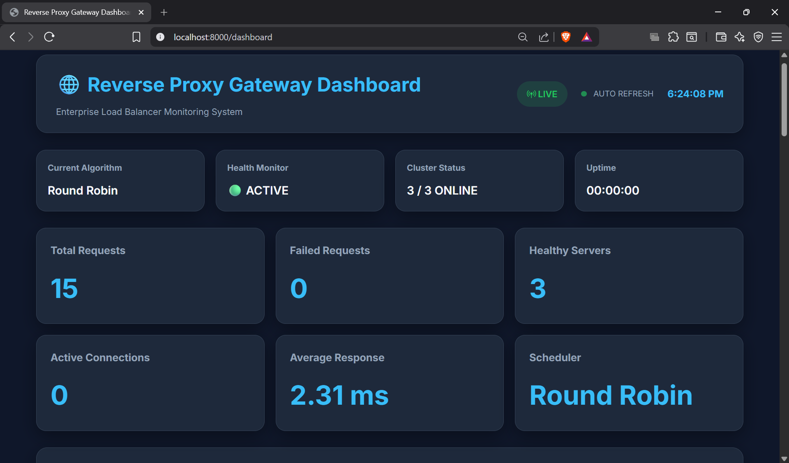
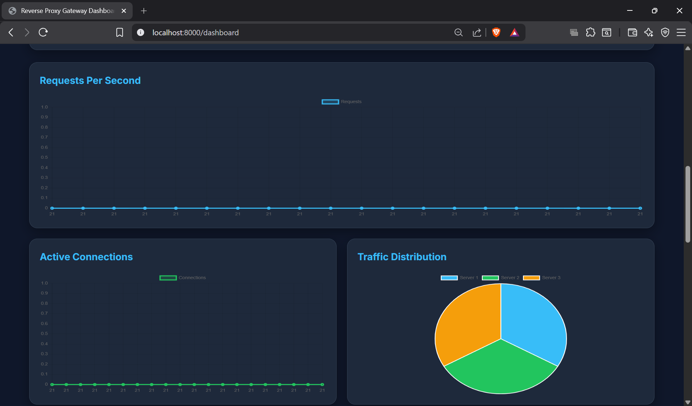
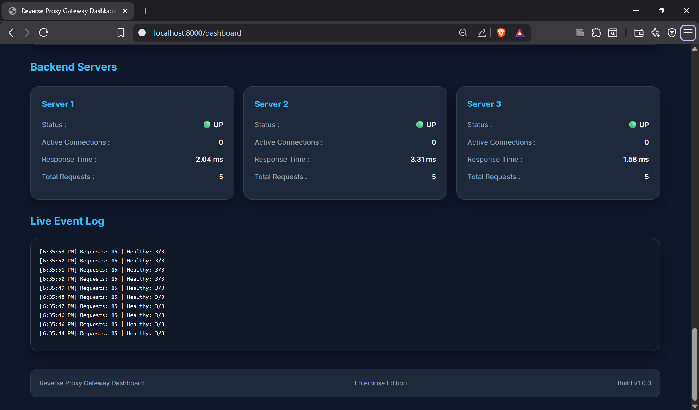
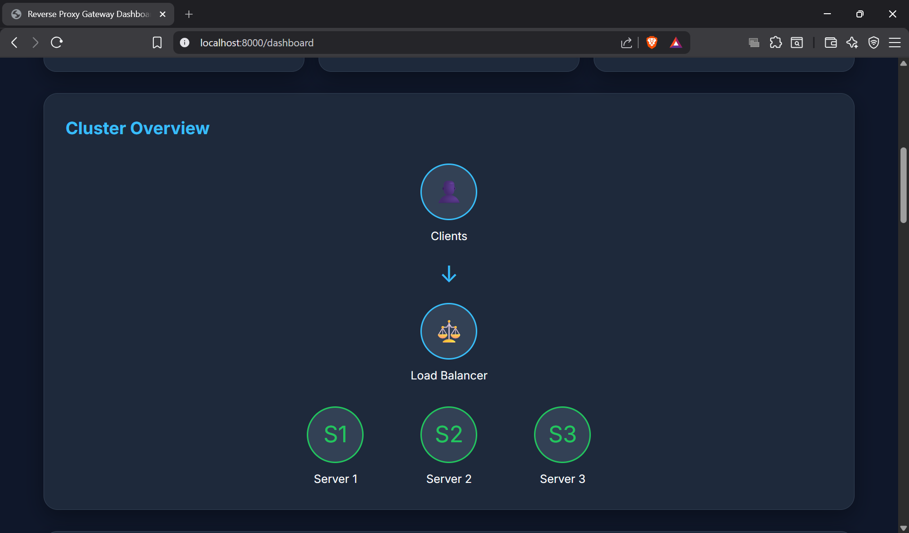

# Reverse Proxy Gateway Dashboard

Enterprise Reverse Proxy Gateway with Real-Time Monitoring Dashboard built using Flask.

---

## Overview

This project is a Flask-based Reverse Proxy Load Balancer that distributes incoming client requests across multiple backend servers.

The system includes a live monitoring dashboard with real-time telemetry including request statistics, backend health monitoring, response time visualization and traffic distribution.

---

## Features

- Reverse Proxy Gateway
- Round Robin Load Balancer
- Multiple Backend Servers
- Health Monitoring
- Live Dashboard
- Real-Time Metrics API
- Request Per Second Chart
- Active Connections Monitoring
- Traffic Distribution Chart
- Response Time Chart
- Backend Server Monitoring
- Live Event Log
- Cluster Overview
- Scheduling Algorithm Panel

---

## Technologies

- Python
- Flask
- HTML5
- CSS3
- JavaScript
- Chart.js

---

## Project Structure

```
loadbalancer-project/

│

├── backend/

│ ├── server1.py

│ ├── server2.py

│ └── server3.py

│

├── dashboard/

│ ├── routes.py

│ ├── templates/

│ ├── static/

│ │ ├── css/

│ │ └── js/

│

├── loadbalancer/

│ ├── app.py

│ ├── config.py

│ ├── telemetry.py

│ ├── metrics.py

│ ├── scheduler.py

│ └── health.py

│

└── README.md
```

---

## Dashboard

### Full Dashboard



---

### Live Charts



---

### Backend Servers



---

### Cluster Overview



---

### Event Log


The dashboard provides:

- Live Request Monitoring
- Backend Health Status
- Traffic Distribution
- Response Time Analysis
- Scheduling Algorithm Status
- Backend Server Statistics
- Event Logging
---

## Scheduling Algorithm

Current

- Round Robin

Future

- Least Connections
- Power of Two Choices (P2C)
- Hybrid Scheduler

---

## Running

Create virtual environment

```bash
python -m venv venv
```

Activate

```bash
source venv/bin/activate
```

Install packages

```bash
pip install -r requirements.txt
```

Start backend servers

```bash
python backend/server1.py

python backend/server2.py

python backend/server3.py
```

Start Load Balancer

```bash
python -m loadbalancer.app
```

Dashboard

```
http://localhost:8000/dashboard
```

---

## Future Improvements

- Dynamic Algorithm Switching
- Automatic Failover
- Docker Deployment
- Kubernetes Deployment
- Authentication
- HTTPS Support
- Rate Limiting
- Prometheus Integration
- Grafana Dashboard

---

## Author

Harish R

B.E. Electronics and Communication Engineering

Network Engineering Enthusiast
