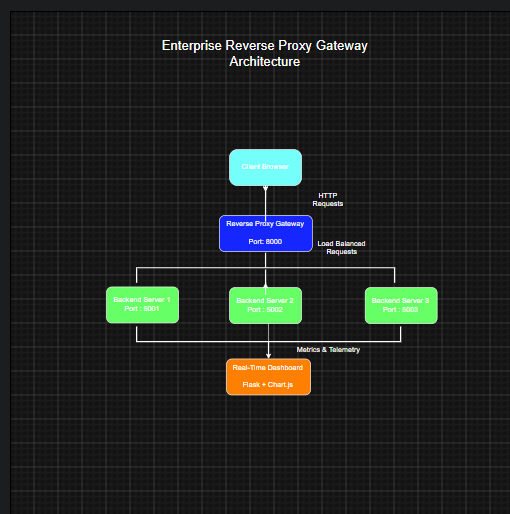

# Reverse Proxy Gateway Dashboard


## Table of Contents

- Overview
- Features
- Technologies
- Project Structure
- Dashboard
- Scheduling Algorithms
- Running the Project
- Future Improvements
- Author
Enterprise Reverse Proxy Gateway with Real-Time Monitoring Dashboard built using Flask and Chart.js.
---

## Overview

This project is a Flask-based Reverse Proxy Load Balancer that distributes incoming client requests across multiple backend servers.

The system includes a live monitoring dashboard with real-time telemetry including request statistics, backend health monitoring, response time visualization and traffic distribution.

---
## System Architecture

The architecture below illustrates how client requests are distributed through the Reverse Proxy Gateway to multiple backend servers. The gateway collects metrics and telemetry from all backend servers and powers a real-time monitoring dashboard built with Flask and Chart.js.



## Features

- ✅ Reverse Proxy Gateway
- ✅ Round Robin Load Balancer
- ✅ Multiple Backend Servers
- ✅ Health Monitoring
- ✅ Real-Time Monitoring Dashboard
- ✅ Live Metrics API
- ✅ Request Per Second Analytics
- ✅ Active Connections Monitoring
- ✅ Traffic Distribution Visualization
- ✅ Response Time Analytics
- ✅ Backend Server Monitoring
- ✅ Live Event Logging
- ✅ Cluster Overview
---

## Technologies

- Python
- Flask
- HTML5
- CSS3
- JavaScript
- Chart.js

---

## Project Structure

```
loadbalancer-project/

│

├── backend/

│ ├── server1.py

│ ├── server2.py

│ └── server3.py

│

├── dashboard/

│ ├── routes.py

│ ├── templates/

│ ├── static/

│ │ ├── css/

│ │ └── js/

│

├── loadbalancer/

│ ├── app.py

│ ├── config.py

│ ├── telemetry.py

│ ├── metrics.py

│ ├── scheduler.py

│ └── health.py

│

└── README.md
```

---

## Dashboard

### Full Dashboard


---

### Live Charts


---

### Backend Servers


---

### Cluster Overview


---

### Event Log


The dashboard provides:

- Live Request Monitoring
- Backend Health Status
- Traffic Distribution
- Response Time Analysis
- Scheduling Algorithm Status
- Backend Server Statistics
- Event Logging
---

## Scheduling Algorithm

Current

- Round Robin

Future

- Least Connections
- Power of Two Choices (P2C)
- Hybrid Scheduler

---

## Running

Create virtual environment

```bash
python -m venv venv
```

Activate

```bash
source venv/bin/activate
```

Install packages

```bash
pip install -r requirements.txt
```

Start backend servers

```bash
python backend/server1.py

python backend/server2.py

python backend/server3.py
```

Start Load Balancer

```bash
python -m loadbalancer.app
```

Dashboard

```
http://localhost:8000/dashboard
```

---

## Future Improvements

- Dynamic Algorithm Switching
- Automatic Failover
- Docker Deployment
- Kubernetes Deployment
- Authentication
- HTTPS Support
- Rate Limiting
- Prometheus Integration
- Grafana Dashboard

---

## Author

Harish R

B.E. Electronics and Communication Engineering

Network Engineering Enthusiast
